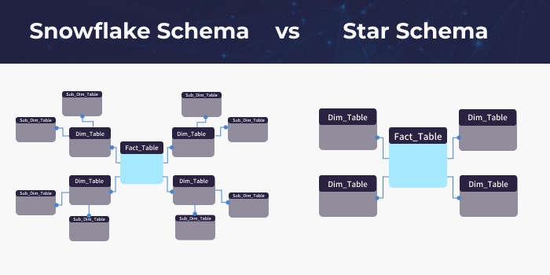
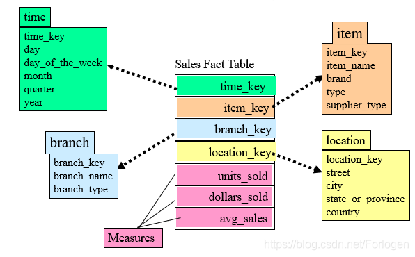
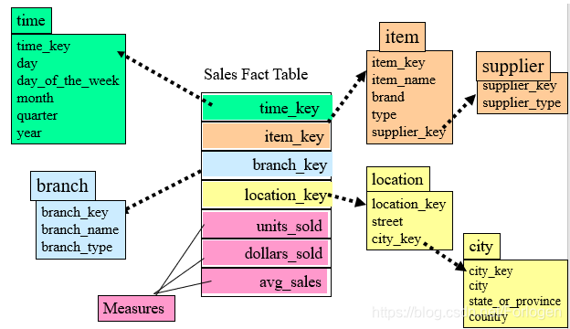
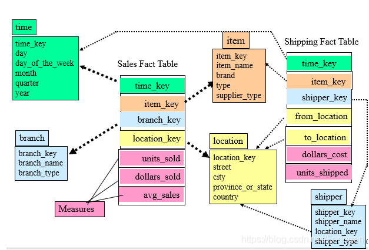

# 02_ecommerce_model


## Schema Overview

This schema follows a star schema design for e-commerce analytics. It consists of dimension tables that describe attributes and fact tables that store measurable business events.

Tables

1. Dimension Tables (Descriptive Data)
    •   dim_date → Time-based attributes (e.g., year, quarter, day of the week)
    •   dim_product → Product attributes (e.g., category, price, brand)
    •   dim_customer → Customer attributes (e.g., name, location, segment)

2. Fact Tables (Transactional Data)
    •   fact_sales → Stores sales transactions per product per order
    •   fact_daily_product_metrics → Stores daily product engagement metrics


## Entity-Relationship Diagram (Star Schema)

```

                     +---------------------+
                     |     dim_date        |
                     |---------------------|
                     | date_key (PK)       |
                     | full_date           |
                     | year                |
                     | month               |
                     | quarter             |
                     | ...                 |
                     +---------------------+
                               |
                               | (FK)
                               |
+---------------------+        +---------------------+        +----------------------+
|   dim_product      |        |     fact_sales      |        |    dim_customer      |
|---------------------|        |---------------------|        |----------------------|
| product_key (PK)   | <-----> | product_key (FK)   |        | customer_key (PK)    |
| product_id         |        | date_key (FK)       | <-----> | customer_id          |
| product_name       |        | customer_key (FK)   |        | first_name           |
| category          |        | order_id            |        | last_name            |
| subcategory       |        | quantity            |        | email                |
| brand            |        | unit_price          |        | country              |
| unit_price       |        | sales_amount        |        | city                 |
| unit_cost        |        | profit_amount       |        | registration_date    |
+---------------------+        +---------------------+        +----------------------+

                        +--------------------------------------+
                        |    fact_daily_product_metrics      |
                        |--------------------------------------|
                        | metric_key (PK)                     |
                        | date_key (FK)                       |
                        | product_key (FK)                    |
                        | page_views                          |
                        | unique_visitors                     |
                        | add_to_cart_count                   |
                        | conversion_rate                     |
                        +--------------------------------------+  
```

Schema Characteristics
-  Fact Tables (Centralized Metrics): fact_sales and fact_daily_product_metrics hold transaction data, linking to dimension tables.
-   Dimension Tables (Reference Data): dim_date, dim_product, and dim_customer provide descriptive attributes.
- Foreign Keys: Fact tables reference dimension tables using foreign keys (FK).
- Indexes: Speed up queries by indexing common filters (e.g., date_key, product_key).


## Concept

1. Fact Table (事實表格)

資料倉儲系統中儲存歷史資料的資料表格，這些都是資料倉儲的核心資料。
如果以一個商用資料倉儲來看，事實表格的資料是以交易為中心的資料，它們可以是物品的銷售，信用卡交易和利息與利潤等資料。 資料倉儲中的事實表格是資料庫中處理得最頻繁的資料表格，也是操作最為頻繁的，所以事實資料表有時可以龐大到占據超過1TB的空間。

事實表紀錄的是從業務或是產品角度的一個計量，可以是一個數字，也可以是一次事件，例如一次購買訂單，這一次的購買會是一筆資料，裡面包含購買的日期、購買的商品、金額等，可以理解成現實世界發生一次的事件，就會對應到事實表中的一筆資料。

- Type: 事件型資料、週期型快照、累積型快照
事實表常見的三種資料顆粒度，事件型就是每一次發生事件就紀錄一筆，例如：用戶完成一筆訂單，週期型則是以你指定的時間區間做好事先加總計算，例如：用戶每週完成訂單數量，累積型則是計算用戶至今完成的數量，例如：用戶至註冊到現在完成多少訂單。

    - 交易型事實表（Transactional Fact Table）：
    定義：記錄每個業務事件或現實世界活動的詳細資料，例如一次銷售、一筆銀行交易或一次訂單
    特點： 每筆資料代表一次具體的業務活動或事件
    例子： 每筆訂單的詳細資訊，包括產品、銷售金額、日期和客戶
    每位學生每份作業的繳交狀況

    - 快照型事實表（Snapshot Fact Table）：
    定義：記錄某個時間點的業務狀態或彙總資訊，通常用於跟蹤長期的業務變化
    特點： 每個時間點記錄當時的狀態數據，例如當天的活躍人數、月底的訂閱人數
    適合進行趨勢分析，分析隨時間變化的模式
    例子： 目前商品的庫存數量
    目前作業的完成人數，每天定時去做一次統計並儲存當前完成的人數

    - 累積型事實表（Accumulating Snapshot Fact Table）：
    定義：記錄一個業務流程的整個生命周期，包含了業務事件的多個階段，並隨著業務進展更新記錄
    特點： 每個業務流程的不同階段都在同一筆資料上進行更新，而不是每次都創建新記錄
    適合追蹤長期的業務變化過程，例如訂單處理流程或客戶技術支援需求的解決進度
    例子： 跟蹤訂單從下單到發貨再到付款的整個過程
    學生作業完成狀況的時間追蹤，依據不同的階段都紀錄階段發生的時間，方便追蹤狀況


- 事實表的設計的注意事項
    - 設計事實表時，需考慮查詢效率、分析彈性以及可擴展性
    - 選擇適當的度量值：度量值是與業務過程直接相關的可量化數據，確保其具備統計意義(平均、加總），以便進行後續的數據分析。
    - 外部鍵： 外部鍵不應包含過多的空值（null），以免影響查詢性能和數據的完整性。
    - 保持事實表的稀疏性：事實表要盡量避免存太多在某些業務流程中沒有意義的資料。
    - 選擇適當的粒度：粒度（granularity）是事實表中每一筆資料的最細粒度的業務事件或過程，粒度越細，事實表越大，但能提供更詳細的分析彈性，粒度過粗會導致無法進行細緻的分析，彈性變小。
    - 考慮時間維度：時間是最常被使用的維度，大部分業務活動都是與時間相關的，應確保時間維度能夠靈活地支援各種時間範圍的查詢，例如日、周、月、季度或年度。
    -避免事實表的過度正規化： 過度的正規化會導致查詢時需要進行過多的JOIN，從而降低查詢效率，也不便於數據使用者理解，事實表中的度量值應該盡量簡潔且直接，避免重複數據。


-> 設計重點： `完全依賴現實世界的實際事件活動，不受可能產生的報表或是分析影響`


2. Dimension Table (維度表格)


-> 維度表的設計的大原則是 `去正規化`


用來定義事實表格中的欄位，例如員工姓名、性別或其他項目等。
使用上和正規化的過程相似，同樣都是擷取有用的資料以加快處理速度。維度表格所包含的資訊，一般可以指出如何從事實表格中取得有用的材料。 因此簡單來說，維度表格是用來記載事實表格中所包含資料的意義。
維度表格通常很小，且只含有幾個資料列。所以資料倉儲一般只會有少數幾個事實表格，卻會有很多個維度表格。

用來描述該事實發生時的情境，可以用`5W (when why who where what)`來理解，做了什麼事、什麼時候發生、誰做了這件事、在哪裡做了這件事、為什麼做這件事，例如：王小明在2024/9/10 完成了國小三年級國語的題目5題。

維度表通常有非常多的欄位，目的就是要減少在分析時需要理解的資料複雜度，所以會盡可能扁平化的設計。


- 常見的維度表類型
    - 時間維度表：
    定義：時間維度表用來描述與時間相關的屬性，如年、季度、月、日、星期等。
    日期是一個最特別的維度表，幾乎所有分析都會涉及時間維度，時間維度表幫助分析某個業務事件在何時發生，能進行趨勢分析、依據不同的時間區間來彙總數據，也可以針對產業的特殊節日做註記
    - 地理維度表：
    定義：地理維度表存儲與地理位置相關的信息，如國家、省份、城市、區域等。
    你可以按縣市、地區做分群，甚至經濟條件、氣候等不同資料分類，來幫助分析不同地區的業務表現或客戶行為。
    - 產品維度表：
    定義：產品維度表描述有關產品的信息，如產品名稱、類別、品牌、尺寸、顏色等。
    用產品屬性來分析銷售數據、產品使用狀況。
    - 客戶維度表：
    定義：與客戶相關的屬性，如客戶姓名、年齡、性別、職業、地理位置等。
    用於分析客戶行為、購買習慣以及按客戶分類的市場細分報告。


- 維度表的設計的注意事項
    - 簡潔易懂結構與欄位定義：屬性的定義和結構簡潔，明確的定義與分析意義，能為分析提供實際價值
    - 避免過度正規化： 過度正規化會導致分析效率降低 -> 維度表應該是 `「寬表」`，以扁平化、多層次屬性放在同一張維度表的做法，減少資料表之間的關聯
    - 緩慢變化維度（Slowly Changing Dimension，SCD) (see below)


3. 緩慢變化維度（Slowly Changing Dimension, SCD)

有些維度隨著時間會發生變化, e.g.：客戶地址變更，處理維度表中資料變化的是一個挑戰，不同情境需要不同處理策略，需考量未來資料的可追溯性，常見處理策略：
        - SCD Type 1：直接覆蓋舊數據，只保留最新的數據。
            - pros: 簡單快速
            - cons: 無法追蹤歷史紀錄
        - SCD Type 2：為每次變更創建一條新記錄，保留變更歷史。
            - pros: 可以追蹤歷史紀錄
            - cons: 增加儲存空間 複雜度
        - SCD Type 3：在原記錄中保留舊值和新值，用於部分歷史查詢。
            - pros: 較少的儲存空間增加
            - cons: 有限的歷史紀錄
        - SCD Type 4: 歷史紀錄表
            - pros: 有效率查找數據, 較少的儲存空間增加
            - cons: 需要維護二個表
                - address, address_history
        - others
            - users, user_extend_attr(json)
        - https://learn.microsoft.com/zh-tw/fabric/data-warehouse/dimensional-modeling-dimension-tables#scd-type-3

4. Change Data Capture (CDC)
- OLTP 的設計目的是為了讓系統功能的運作順暢，並不是針對分析的需求，很多時候有留存變化的資料, -> 怎麼處理？

- e.g. 客戶地址改變, 產品類別改變, 用戶狀態改變...

- 方案一：定期做資料快照
- 方案二：請RD增加紀錄
- 方案三：分析log，抓RD API 呼叫的紀錄
    - BE log
    - [DEBUG] 20250101,uid-001,ORDER,prod_01,100,....
- 方案四：在 OLTP 設置 Trigger
- 方案五：透過第三方工具，解析OLTP 的 DML log


5.  Star Schema
- 在Star Schema中，事實表位於中央，維度表環繞在周圍，幾乎一次JOIN 就能得到所需要的資訊，看起來像是星星的形狀。

6. Snowflake Schema
- 事實表一樣位於中央，維度表環繞周圍，與Star Schema不同的地方是可能會有多層的維度表，長得像是雪花一樣。

<p align="center"></p>

<p align="center"></p>

<p align="center"></p>

<p align="center"></p>


## Practice

(OLAP)

1. 假設有ㄧ個網上程式碼測驗平台(e.g. leetcode.com), 用戶可以撰寫, 提交程式碼
系統會評鑑並產出程式碼正確與否還有效率, 根據以上敘述, 設計DB schema (Entity Relationship Diagram (ERD))

2. 假設有ㄧ個音樂平台(e.g. youtube music), 用戶可以聽收聽音樂 上傳音樂 建立播放清單, 根據以上敘述, 設計DB schema (Entity Relationship Diagram (ERD))


## Code

- [02_ecommerce_model.sql](../02_ecommerce_model.sql)

## Ref

- https://learn.microsoft.com/zh-tw/fabric/data-warehouse/dimensional-modeling-dimension-tables
- https://ithelp.ithome.com.tw/articles/10358495
- https://ithelp.ithome.com.tw/articles/10360844
- https://learn.microsoft.com/zh-tw/fabric/data-warehouse/dimensional-modeling-fact-tables


## DB modeling tool
- https://dbdiagram.io/d
- https://runsql.com/r
- https://www.smartdraw.com/