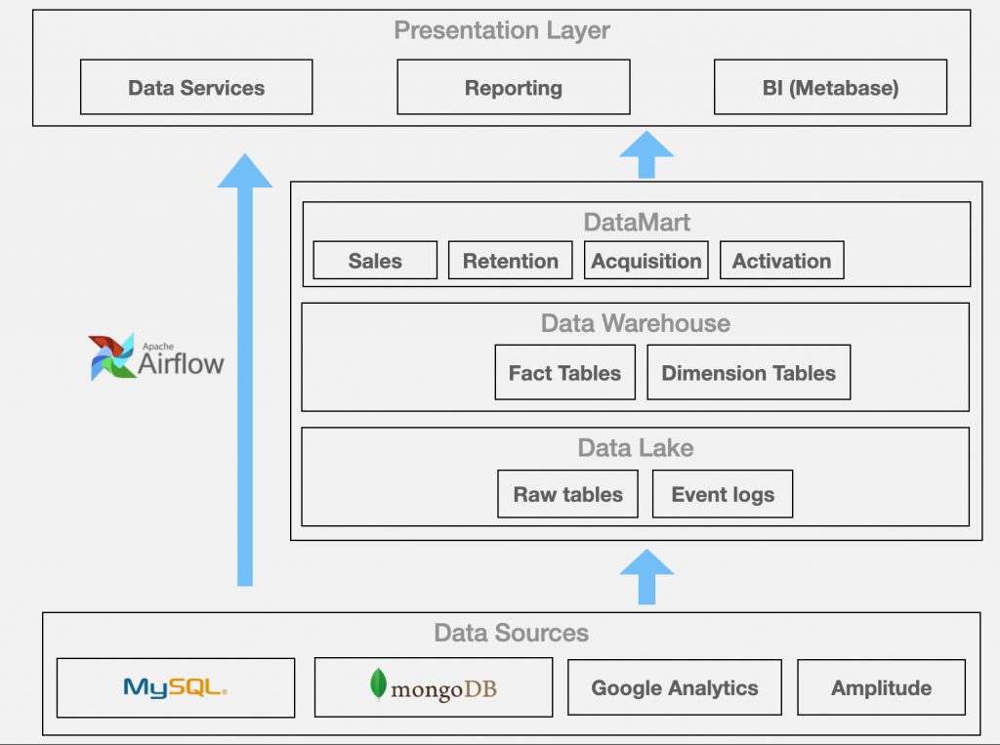
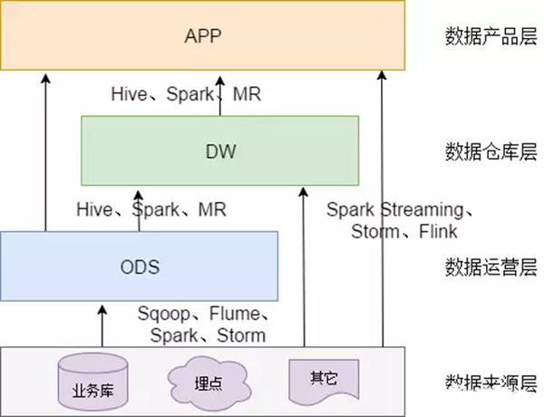

# 03_datamart_warehouse_tutorial

## Concept

- Data lake VS data warehouse VS data mart

| Stage          | Purpose                   | Technology                  | Example Table                                       |
|---------------|---------------------------|-----------------------------|-----------------------------------------------------|
| **Data Lake**  | Stores raw data           | AWS S3, Hadoop              | `raw_game_events`, `raw_ad_campaigns`, `raw_transactions` |
| **Data Warehouse** | Cleans & structures data | Redshift, Snowflake, BigQuery | `dw_game_events`, `dw_ad_campaigns`, `dw_transactions` |
| **Data Mart**  | Optimized for analytics   | Redshift, BI tools          | `dm_player_sessions`, `dm_campaign_performance`, `dm_revenue_summary` |

- ELT VS ETL
	- 擷取、載入和轉換 (ELT) VS 擷取、轉換和載入 (ETL)
	- https://aws.amazon.com/tw/compare/the-difference-between-etl-and-elt/#:~:text=ETL%20%E6%9C%80%E9%81%A9%E5%90%88%E6%96%BC%E6%82%A8,%E7%AD%89%E9%9D%9E%E7%B5%90%E6%A7%8B%E5%8C%96%E8%B3%87%E6%96%99%E3%80%82

- 數據庫分層:

	- ODS, DW, DWD, DWS, DIM, APP
	- ODS (Operational Data Store)
		- operationl data store: after ETL, basic process
		- tores raw, near real-time operational data from transactional databases.
		- Usually denormalized and optimized for quick updates.
	- DW (Data Warehouse)
		- Stores structured and historical data optimized for analysis and reporting.
		- Extracts, transforms, and loads (ETL) data from the ODS.
		- sub layers:
			- DWD (Detail Data Warehouse)
				- Contains cleansed and detailed historical data.
				- Acts as an intermediate step before data aggregation.
			- DWS (Service Data Warehouse)
				- Stores aggregated data used for analytics and business reports.
				- Typically, pre-aggregated tables for faster query performance.
			- DIM (Dimension Tables)
				- Stores categorical attributes, such as user profiles, product details, and location hierarchies.
				- Helps in slicing and dicing data in analytical queries.
	- APP (Application Layer)
		- Serves processed data for applications, dashboards, and reports.
		- Often used in BI tools like Tableau, Power BI, or custom dashboards.
	- Ref
		- https://blog.csdn.net/pmdream/article/details/113601956
		- https://communeit.medium.com/%E6%9C%80%E5%BC%B7%E6%9C%80%E5%85%A8%E9%9D%A2%E7%9A%84%E8%B3%87%E6%96%99%E5%80%89%E5%BA%AB%E5%BB%BA%E8%A8%AD%E8%A6%8F%E7%AF%84%E6%8C%87%E5%8D%97-%E7%B4%94%E4%B9%BE%E8%B2%A8%E5%88%86%E4%BA%AB-651d4b8394fa

## Code

- [03_datamart_warehouse.sql](../03_datamart_warehouse.sql)
- [03_datamart_warehouse_pt2.sql](../03_datamart_warehouse_pt2.sql)

## Ref
- https://ithelp.ithome.com.tw/articles/10357605 - 3 layer of DW
	- Data lake -> data warehouse -> data mart